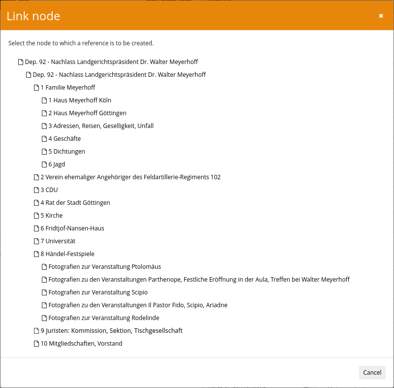

After installing the plugin and the associated database, the plugin must also be configured. This takes place within the configuration file `plugin_intranda_administration_archive_management.xml` and is structured as follows as an example:

{{CONFIG_CONTENT}}


## General configuration
The connection to the Goobi viewer is configured in the `<export>` area. The location to which an export as EAD-XML is to be made and which inventories are to be exported are defined here. The export takes place automatically at regular intervals or can be started manually from the user interface.

In the second area `<backup>` an automatic backup of the individual inventories can be configured. A separate file is created for each inventory. You can define how many backups should be kept and which tool should be used to create the backups. If a password is required for database access, this can also be configured here.

This is followed by a repeatable `<config>` block. The repeatable `<archive>` element can be used to specify which files the `<config>` block should apply to. If there is to be a default block that applies to all documents, `*` can be used.

The `<processTemplateId>` is used to specify the production template on the basis of which the Goobi processes are to be created.


## Configuration of the generation of task titles
The parameters `<lengthLimit>` `<separator>` `<useIdFromParent>` and `<title>` are used to configure the naming of the task to be generated:

- The value `<lengthLimit>` sets a length limit for all tokens except the manually set prefix and suffix. The default setting is `0`, i.e. it does not limit the length.
- The parameter `<separator>` defines the separator to be used to combine all separate tokens. The default setting is `_`.
- The parameter `<useIdFromParent>` configures whose ID should be used to create the task title. If it is set to `true`, the ID of the parent node is used. Otherwise, the ID of the current node is used.
- The `<title>` parameter configures which metadata should be used for the title generation. The `value` attribute can contain a static text or the `name` attribute can contain the name of a metadata field. The `type` is used to control what should happen with the value `NORMAL` inserts the field unchanged, `CAMEL_CASE` replaces spaces and starts each word with a capital letter, `AFTER_LAST_SEPARATOR` always inserts the field at the end, `BEFORE_FIRST_SEPARATOR` always inserts it at the beginning. If no title has been configured, the process title is formed on the basis of the node ID.


## Configuration of the reference between node and process

The two parameters `<nodeIdentifierField>` and `<processIdentifierField>` are used to link the node and the process. The `<nodeIdentifierField>` field contains the name of the field that contains the identifier of the node. Any configured field can be used. Unless otherwise specified, `id` is used. The `<processIdentifierField>` contains the metadata in which the identifier of the node is to be saved. This is usually `NodeId`.

If a new EAD file is imported or the ‘ Update references to processes ’ button is used, the configured metadata is searched for in all processes. The system then compares whether the metadata contains the value that is entered in the field in a node. If this is the case, a link is created between the node and the process. For all nodes for which no match was found, any existing links are removed.

## Configuration of the metadata fields
This is followed by a list of `<metadata>` elements. This controls which fields are displayed, can be imported, how they should behave and whether there are validation rules.


### Mandatory information
Each metadata field consists of at least the following mandatory information:

| Value | Description |
| :--- | :--- |
| `name` | This value is used to identify the field. It must therefore contain a unique name. If the value has not been configured separately in the messages files, it is also used as the label of the field. |
| `level` | This defines the area in which the metadata is inserted. The numbers 1-7 are permitted: `1. identification`, `2. context`, `3. content and internal organisation`, `4. conditions of access and use`, `5. related documents`, `6. notes`, `7. directory control`. |


### Optional information
There are also a number of other optional details:

| Value | Description |
| :--- | :--- |
| `xpath` | Defines an XPath expression that is used both for reading from existing EAD files and for writing the EAD file. In the case of the main element, the path is relative to the `<ead>` element; for all other nodes, it is always relative to the `<c>` element. |
| `@xpathType` | This defines whether the XPath expression returns an `element` \(default\), an `attribute` or a `text`. |
| `@visible` | This can be used to control whether the metadata is displayed in the mask or hidden. The field may contain the two values `true` \(default\) and `false`. |
| `@repeatable` | Defines whether the field is repeatable. The field may contain the two values `true` and `false` \(default\). |
| `@showField` | Defines whether the field is displayed open in the detail display, even if no value is yet available. The field may contain the two values `true` and `false` \(default\). |
| `@rulesetName` | A metadata from the rule set can be specified here. When a Goobi process is created for the node, the configured metadata is created. |
| `@importMetadataInChild` | This can be used to control whether the metadata should also be created in Goobi processes of child nodes. The field may contain the two values `true` and `false` \(default\). |
| `@fieldType` | Controls the behaviour of the field. Possible are `input` \(default\) , `textarea`, `dropdown`, `multiselect`, `vocabulary`, `nodelink`, `gnd`, `geonames`, `viaf`, `group`, `person`, `corporate` |
| `value` | This sub-element is only used for the two types ‘dropdown’ and ‘multiselect’ and contains the possible values that are to be available for selection. |
| `vocabulary` | This sub-element contains the name of the vocabulary to be used. It is only evaluated if `vocabulary`, `dropdown` or `multiselect` is set in the field type and no `<value>` elements have been configured. The selection list contains the main value of each record. |
| `searchParameter` | This repeatable subfield can be used to define search parameters with which the vocabulary is filtered, the syntax is `fieldname=value`. |
| `@validationType` | Here you can set whether the field should be validated. Different rules are possible, which can be combined. `unique` checks that the content of the field has not been used elsewhere, `required` ensures that the field contains a value. The type `regex` can be used to check whether the value filled in corresponds to a regular expression, `date` checks whether the value corresponds to an EDTF date and `list` tests whether the value used is contained in the configured list.
Several validation rules can also be combined, for example `unique+required`, `regex+required`, `regex+unique` or `date+required`. In this case, all specified rules must be fulfilled.|
| `@regularExpression` | The regular expression to be used for `regex` validation is specified here. IMPORTANT: the backslash must be masked by a second backslash. A class is therefore not defined by `\w`, but by `\w`. |
| `validationError` | This subfield contains a text that is displayed if the field content violates the validation rules. |
| `@searchable` | This can be used to control whether the metadata should be offered as a field in the advanced search. The field may contain the two values `true` and `false` \(default\). |


## Examples of different field configurations

### Simple input field
```xml
<metadata xpath="./ead:control/ead:maintenanceagency/ead:agencycode" xpathType="element" name="agencycode" level="1" repeatable="false" fieldType="input"/>
```


### Textfeld
```xml
<metadata xpath="(./ead:archdesc/ead:did/ead:unittitle | ./ead:did/ead:unittitle)[1]" xpathType="element" name="unittitle" level="1" repeatable="false" fieldType="textarea" rulesetName="TitleDocMain" importMetadataInChild="false" />
```


### Selection list
```xml
<metadata xpath="(./ead:archdesc/@level | ./@level)[1]" xpathType="attribute" name="descriptionLevel" level="1" repeatable="false" fieldType="dropdown">
    <value>collection</value>
    <value>fonds</value>
    <value>class</value>
    <value>recordgrp</value>
    <value>series</value>
    <value>subfonds</value>
    <value>subgrp</value>
    <value>subseries</value>
    <value>file</value>
    <value>item</value>
    <value>otherlevel</value>
</metadata>
```


### Multiple selection
```xml
        <metadata xpath="(./ead:archdesc/ead:did/ead:langmaterial[@label='font'] | ./ead:did/ead:langmaterial[@label='font'])[1]" xpathType="element" name="font" level="4" repeatable="false"
            fieldType="multiselect" rulesetName="FontType" importMetadataInChild="false">
            <value>antiqua</value>
            <value>fracture</value>
            <value>handwritten</value>
            <value>mixed</value>
            <value>no text</value>
        </metadata>
```


### Validierung von Datumsangaben im ISO 8601 Format
```xml
<metadata xpath="(./ead:archdesc/ead:did/ead:unitdate | ./ead:did/ead:unitdate)[1]" xpathType="element" name="unitdate" level="1" repeatable="false" rulesetName="PublicationYear" importMetadataInChild="false" regularExpression="^([0-9]{4}\\-[0-9]{2}\\-[0-9]{2}|[0-9]{4})(\\s?\\-\s?([0-9]{4}\\-[0-9]{2}\\-[0-9]{2}|[0-9]{4}))?$" validationType="regex">
  <validationError>Der Wert ist keine Datumsangabe. Erlaubte Werte sind entweder Jahreszahlen (YYYY), exakte Datumsangaben (YYYY-MM-DD) oder Zeiträume (YYYY - YYYY, YYYY-MM-DD-YYYY-MM-DD)</validationError>
</metadata>
```


### Validation of dates in EDTF format
```xml
<metadata xpath="(./ead:archdesc/ead:did/ead:unitdate | ./ead:did/ead:unitdate)[1]" xpathType="element" name="unitdate" level="1" repeatable="false" rulesetName="PublicationYear" importMetadataInChild="false" validationType="date">
  <validationError>Der Wert ist keine Datumsangabe</validationError>
</metadata>
```


### Connection of a controlled vocabulary
```xml
<metadata xpath="(./ead:archdesc/ead:dsc/ead:acqinfo | ./ead:dsc/ead:acqinfo)[1]" xpathType="element" name="acqinfo" level="2" repeatable="false" fieldType="vocabulary" rulesetName="AquisitionInformation" >
  <vocabulary>Aquisition</vocabulary>
  <searchParameter>type=visible</searchParameter>
  <searchParameter>active=true</searchParameter>
</metadata>
```


### Linking to another node within the inventory
```xml
        <metadata xpath="(./ead:archdesc/ead:relatedmaterial/ead:ref | ./ead:relatedmaterial/ead:ref)" xpathType="element" name="nodelink" fieldType="nodelink" level="5" repeatable="false" />
```





### Search in the GND
```xml
            <metadata xpath="./ead:archdesc/ead:index/ead:indexentry/ead:persname/ead:part" xpathType="element" name="Person" level="7" repeatable="true" fieldType="gnd" visible="true" />
```


## Search in Geonames
```xml
            <metadata xpath="./ead:archdesc/ead:index/ead:indexentry/ead:geogname/ead:part[@localtype='place']" xpathType="element" name="Place" level="7" repeatable="true" fieldType="geonames" visible="true" />
```


## Search in VIAF
```xml
            <metadata xpath="./ead:archdesc/ead:index/ead:indexentry/ead:corpname/ead:part" xpathType="element" name="Corporate" level="7" repeatable="true"
                searchable="true" showField="true" fieldType="viaf" searchFields="210__a; 111__a; 100__a; 110__a; 150__a; 151__a;"
                displayFields="001=NORM_IDENTIFIER; 0247_a=URI; 1001_a=NORM_NAME; 1001_d=NORM_LIFEPERIOD; 1001_q=NORM_SEX; 375__a=NORM_SEX;" />
```


## Grouped fields
```xml
        <metadata xpath="./ead:archdesc/ead:did/ead:repository" group="true" name="repository" level="1" repeatable="true" visible="false" fieldType="group" rulesetName="Repository">
            <metadata xpath="@label" xpathType="attribute" name="repositoryLabel" level="1" repeatable="false" visible="true" rulesetName="RepositoryLabel" />
            <metadata xpath="ead:address/ead:addressline" xpathType="element" name="repositoryaddressline" level="1" repeatable="true" visible="true" rulesetName="RepositoryAddress" />
            <metadata xpath="ead:extref/@href" xpathType="attribute" name="extrefhref" level="1" repeatable="true" visible="true" rulesetName="RepositoryLink" />
            <metadata xpath="ead:extref" xpathType="element" name="extref" level="1" repeatable="true" visible="true" rulesetName="RepositoryLinkName" />
        </metadata>
```


## Persons
```xml
        <metadata xpath="(./ead:archdesc/ead:indexentry/ead:persname[@relator='aut'] | ./ead:indexentry/ead:persname[@relator='aut'])" name="Author"  level="2" repeatable="true" visible="true"  fieldType="person" rulesetName="Author">
            <lastname xpath="ead:part[@localtype='surname']" xpathType="element" />
            <firstname xpath="ead:part[@localtype='givenname']" xpathType="element" />
            <authorityValue xpath="@identifier" xpathType="attribute" />
        </metadata>
```


## Corporates
```xml
        <metadata xpath="(./ead:archdesc/ead:indexentry/ead:corpname[@relator='his'] | ./ead:indexentry/ead:corpname[@relator='his'])" name="HostInstitution"  level="2" repeatable="true" visible="true"  fieldType="corporate" rulesetName="HostInstitution">
            <value xpath="ead:part[@localtype='corporate name']" xpathType="element" />
            <subvalue xpath="ead:part[@localtype='subordinate unit']" xpathType="element" />
            <partvalue xpath="ead:part[@localtype='part/section/meeting']" xpathType="element" />
            <authorityValue xpath="@identifier" xpathType="attribute" />
        </metadata>
```


## Configuration of the display of the areas
In the default setting, the individual sections 1 `Identification`, 2 `Context`, 3 `Content and internal organisation`, 4 `Access and usage conditions`, 5 `Related documents`, 6 `Notes` and 7 `Directory control` are collapsed for reasons of space and are not displayed. The element `<showGroup level=‘1’ />` can be used so that they are already expanded and displayed when a node is selected. The ordinal number in the level attribute is used to control which area is expanded. The attribute `showField=‘true’` can be used within the `<metadata>` definition to display unfilled metadata immediately without adding it using a badge.


## Configuration of the XML namespace
The two elements `<eadNamespaceRead>` and `<eadNamespaceWrite>` define which XML namespaces are to be used for reading and writing EAD documents. Usually both contain the same value. However, EAD2 documents can also be read and exported as EAD3 documents. In this case, the corresponding namespaces must be defined and care must be taken in the xpath expressions of the individual metadata to ensure that both variants are specified. It is therefore easier to use the enclosed converter and convert from EAD2 to EAD3 before importing the documents.

- Namespace for ead2 (current): urn:isbn:1-931666-22-9
- Namespace for ead3 (current): http://ead3.archivists.org/schema/
- Namespace for ead4 (in draft status): https://archivists.org/ns/ead/v4


## Configuration of the different node types

The node types are defined using the `<node>` element.

```xml
        <node name="archive" icon="fa fa-archive" rootNode="true" allowProcessCreation="false">
            <child>folder</child>
        </node>

        <node name="folder" icon="fa fa-folder-open-o" allowProcessCreation="false">
            <child>folder</child>
            <child>file</child>
            <child>image</child>
            <child>audio</child>
            <child>video</child>
            <child>other</child>
        </node>

        <node name="file" ruleset="File" icon="fa fa-file-text-o" allowProcessCreation="true" />
        <node name="image" ruleset="Picture" icon="fa fa-file-image-o" allowProcessCreation="true" />
        <node name="audio" ruleset="Audio" icon="fa fa-file-audio-o" allowProcessCreation="true" />
        <node name="video" ruleset="Video" icon="fa fa-file-video-o" allowProcessCreation="true" />
        <node name="other" ruleset="Other" icon="fa fa-file-o"  allowProcessCreation="true" />
```

The `name` attribute must contain a unique value, which is used to identify the type internally. The `ruleset` contains the name of the structure element in the ruleset that is to be used when a process is created for this node. This function is only available if the attribute `allowProcessCreation` is set with the value `true`. The icon to be displayed in the interface for this node type is configured in `icon`.

Use `rootNode="true|false"` to define whether the node may be used as the top element of the archive tree. All node types that are permitted below a type must be specified in the `<child>` element.
