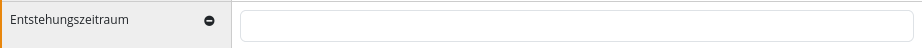
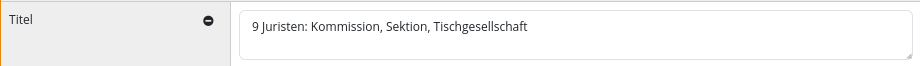
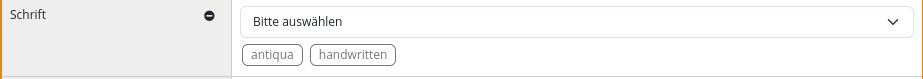
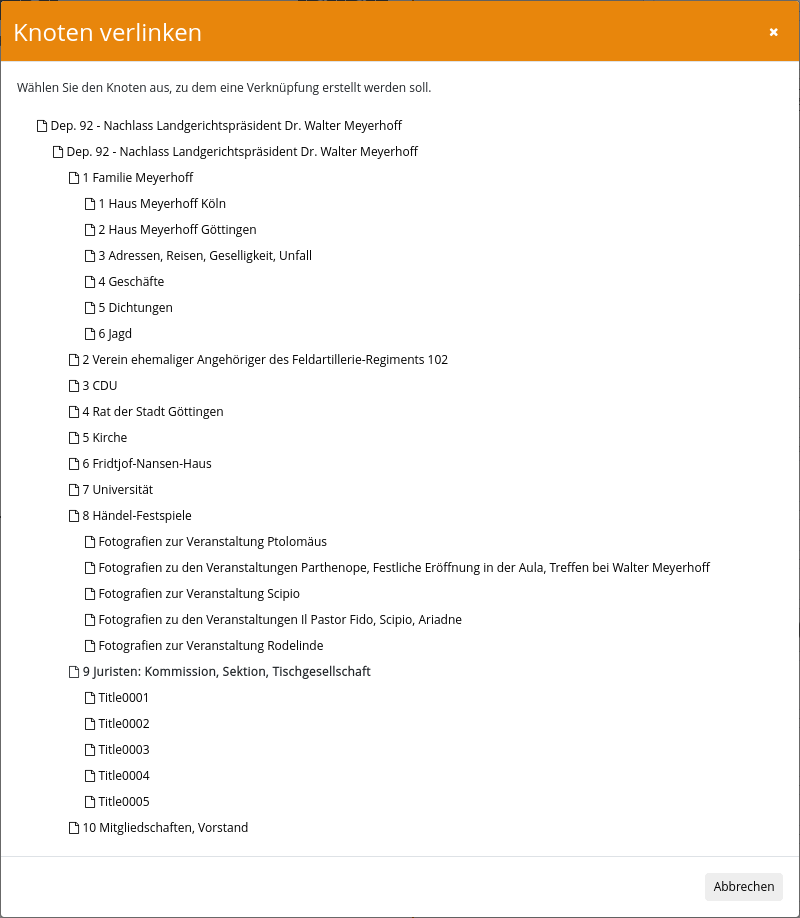

Nach der Durchführung der Installation des Plugins und der zugehörigen Datenbank muss ebenfalls noch eine Konfiguration des Plugins erfolgen. Diese findet innerhalb der Konfigurationsdatei `plugin_intranda_administration_archive_management.xml` statt. und ist beispielhaft wie folgt aufgebaut:

{{CONFIG_CONTENT}}

## Allgemeine Konfiguration

Im Bereich `<export>` wird die Anbindung an den viewer konfiguriert. Hier wird der Ort festgelegt, an den ein Export als EAD-XML erfolgt und welche Bestände exportiert werden sollen. Der Export erfolgt automatisch in regelmäßigen Abständen oder kann manuell aus der Nutzeroberfläche gestartet werden.

Im zweiten Bereich `<backup>` kann ein automatisches Backup der einzelnen Bestände konfiguriert werden. Dabei wird für jeden Bestand eine eigene Datei erzeugt. Es kann definiert werden, wie viele Backups vorgehalten werden sollen und welches Tool zum erzeugen der Backups genutzt werden soll. Falls ein Passwort für den Datenbank Zugriff benötigt wird, kann dies hier ebenfalls konfiguriert werden.

Anschließend folgt ein wiederholbarer `<config>` Block. Über das wiederholbare Element `<archive>` kann festgelegt werden, für welche Dateien der `<config>` Block gelten soll. Soll es einen Default-Block geben, der für alle Dokumente gelten soll, kann `*` genutzt werden.

Mittels `<processTemplateId>` wird festgelegt, auf Basis welcher Produktionsvorlage die erstellten Goobi-Vorgänge erstellt werden sollen.


## Konfiguration der Generierung von Vorgangstiteln
Die Parameter `<lengthLimit>` `<separator>` `<useIdFromParent>` und `<title>` werden verwendet, um die Benennung des zu erzeugenden Vorgangs zu konfigurieren:

* Der Wert `<lengthLimit>` setzt ein Längenlimit für alle Tokens außer dem manuell gesetzten Präfix und Suffix. Die Voreinstellung ist `0`, begrenzt die Länge also nicht.
* Der Parameter `<separator>` definiert das Trennzeichen, das verwendet werden soll, um alle separaten Tokens zu kombinieren. Die Voreinstellung ist `_`.
- Der Parameter `<useIdFromParent>` konfiguriert, wessen ID für die Erstellung des Vorgangstitels verwendet werden soll. Wenn er auf `true` gesetzt ist, wird die ID des übergeordneten Knotens verwendet. Andernfalls wird die ID des aktuellen Knotens verwendet.
- Der Parameter `<title>` konfiguriert, welche Metadaten für die Titelgenerierung genutzt werden sollen. Dabei kann das Attribut `value` einen statischen Text oder das Attribut `name` den Namen eines Metadatenfeldes beinhalten. Mittels `type` wird gesteuert, was mit dem Wert geschehen soll `NORMAL` fügt das Feld unverändert ein, `CAMEL_CASE` ersetzt Leerzeichen und lässt jedes Wort mit einem Großbuchstaben starten, `AFTER_LAST_SEPARATOR` fügt das Feld immer am Ende an, `BEFORE_FIRST_SEPARATOR` fügt es immer am Anfang an. Wenn kein title konfiguriert wurde, wird der Vorgangstitel auf Basis der node ID gebildet.


## Konfiguratioan der Metadatenfelder

Anschließend folgt eine Liste von `<metadata>` Elementen. Darüber wird gesteuert, welche Felder angezeigt werden, importiert werden können, wie sie sich verhalten sollen und ob es Validierungsregeln gibt.

### Pflichtangaben

Jedes Metadatenfeld besteht aus mindestens den folgenden Pflichtangaben:

| Wert | Beschreibung |
| :--- | :--- |
| `name` | Mit diesem Wert wird das Feld identifiziert. Es muss daher eine eindeutige Bezeichnung enthalten. Sofern der Wert nicht noch extra in den messages Dateien konfiguriert wurde, wird er auch als Label des Feldes genutzt. |
| `level` | Hiermit wird definiert, in welchem Bereich das Metadatum eingefügt wird. Dabei sind die Zahlen 1-7 erlaubt: `1. Identifikation`, `2. Kontext`, `3. Inhalt und innere Ordnung`, `4. Zugangs- und Benutzungsbedingungen`, `5. Sachverwandte Unterlagen`, `6. Anmerkungen`, `7. Verzeichnungskontrolle` |

### Optionale Angaben

Des weiteren gibt es noch eine Reihe weiterer optionaler Angaben:

| Wert | Beschreibung |
| :--- | :--- |
| `xpath` | Definiert einen XPath Ausdruck, der sowohl zum Lesen aus vorhanden EAD Dateien als auch zum Schreiben der EAD Datei genutzt wird. Der Pfad ist im Fall des Hauptelements relativ zum `<ead>` Element, bei allem anderen Knoten immer relativ zum `<c>` Element. |
| `@xpathType` | Hiermit wird definiert, ob der XPath Ausdruck ein `element` \(default\), ein `attribute` oder einen `text` zurückliefert. |
| `@visible` | Hierüber kann gesteuert werden, ob das Metadatum in der Maske angezeigt wird oder versteckt ist. Das Feld darf die beiden Werte `true` \(default\) und `false` enthalten. |
| `@repeatable` | Definiert, ob das Feld wiederholbar ist. Das Feld darf die beiden Werte `true` und `false` \(default\) enthalten. |
| `@showField` | Definiert, ob das Feld in der Detailanzeige geöffnet angezeigt wird, auch wenn noch kein Wert vohanden ist. Das Feld darf die beiden Werte `true` und `false` \(default\) enthalten. |
| `@rulesetName` | Hier kann ein Metadatum aus dem Regelsatz angegeben werden. Wenn für den Knoten ein Goobi-Vorgang erstellt wird, wird das konfigurierte Metadatum erstellt. |
| `@importMetadataInChild` | Hierüber kann gesteuert werden, ob das Metadatum auch in Goobi-Vorgängen von Kind-Knoten erstellt werden soll. Das Feld darf die beiden Werte `true` und `false` \(default\) enthalten. |
| `@fieldType` | Steuert das Verhalten des Feldes. Möglich sind `input` \(default\) ,  `textarea`,  `dropdown`, `multiselect`, `vocabulary`, `nodelink`, `gnd`, `geonames`, `viaf` |
| `value` | Dieses Unterelement wird nur bei den beiden Typen `dropdown` und  `multiselect` genutzt und enthält die möglichen Werte, die zur Auswahl stehen sollen. |
| `vocabulary` | Dieses Unterelement enthält den Namen des zu verwendenden Vokabulars. Es wird nur ausgewertet, wenn `vocabulary`, `dropdown` oder `multiselect` im Typ des Feldes gesetzt ist und keine `<value>` Elemente konfiguriert wurden. Die Auswahlliste enthält jeweils den Hauptwert der Records. |
| `searchParameter` | Mit diesem wiederholbaren Unterfeld können Suchparameter definiert werden, mit denen das Vokabular gefiltert wird, die Syntax ist `fieldname=value`. |
| `@validationType` | Hier kann eingestellt werden, ob das Feld validiert werden soll. Dabei sind unterschiedliche Regeln möglich, die sich kombinieren lassen. `unique` prüft, dass der Inhalt des Feldes nicht noch einmal an einer anderen Stelle genutzt wurde, mittels `required` wird sichergestellt, dass das Feld einen Wert enthhält. Mit dem Typ `regex` kann geprüft werden, ob der ausgefüllte Wert einem regulären Ausdruck entspricht, `date` prüft, ob der Wert einem EDTF Datum entspricht und `list` testet, ob der verwendete Wert in der konfigurierten Liste enthalten ist.
Es können auch mehrere Validierungsregeln kombiniert werden, zum Beispiel `unique+required`, `regex+required`, `regex+unique` oder `date+required`. In diesem Fall müssen alle angegeben Regeln erfüllt werden.|
| `@regularExpression` | Hier wird der reguläre Ausdruck angegeben, der bei der `regex` Validierung genutzt werden soll. WICHTIG: der Backslash muss dabei durch einen zweiten Backslash maskiert werden. Eine Klasse wird daher nicht durch `\w`, sondern durch `\\w` definiert. |
| `validationError` | Dieses Unterfeld enthält einen Text, der angezeigt wird, wenn der Feldinhalt gegen die Validierungsregeln verstößt. |
| `@searchable` | Hierüber kann gesteuert werden, ob das Metadatum in der erweiterten Suche als Feld angeboten werden soll. Das Feld darf die beiden Werte `true` und `false` \(default\) enthalten. |

## Beispiele für verschiedene Feld-Konfigurationen

### Einfaches Eingabefeld

```xml
<metadata xpath="./ead:control/ead:maintenanceagency/ead:agencycode" xpathType="element" name="agencycode" level="1" repeatable="false" fieldType="input"/>
```




### Textfeld

```markup
<metadata xpath="(./ead:archdesc/ead:did/ead:unittitle | ./ead:did/ead:unittitle)[1]" xpathType="element" name="unittitle" level="1" repeatable="false" fieldType="textarea" rulesetName="TitleDocMain" importMetadataInChild="false" />
```




### Auswahlliste

```xml
<metadata xpath="(./ead:archdesc/@level | ./@level)[1]" xpathType="attribute" name="descriptionLevel" level="1" repeatable="false" fieldType="dropdown">
    <value>collection</value>
    <value>fonds</value>
    <value>class</value>
    <value>recordgrp</value>
    <value>series</value>
    <value>subfonds</value>
    <value>subgrp</value>
    <value>subseries</value>
    <value>file</value>
    <value>item</value>
    <value>otherlevel</value>
</metadata>
```


### Mehrfachauswahl

```xml
        <metadata xpath="(./ead:archdesc/ead:did/ead:langmaterial[@label='font'] | ./ead:did/ead:langmaterial[@label='font'])[1]" xpathType="element" name="font" level="4" repeatable="false"
            fieldType="multiselect" rulesetName="FontType" importMetadataInChild="false">
            <value>antiqua</value>
            <value>fracture</value>
            <value>handwritten</value>
            <value>mixed</value>
            <value>no text</value>
        </metadata>
```




### Validierung von Datumsangaben im ISO 8601 Format

```xml
<metadata xpath="(./ead:archdesc/ead:did/ead:unitdate | ./ead:did/ead:unitdate)[1]" xpathType="element" name="unitdate" level="1" repeatable="false" rulesetName="PublicationYear" importMetadataInChild="false" regularExpression="^([0-9]{4}\\-[0-9]{2}\\-[0-9]{2}|[0-9]{4})(\\s?\\-\s?([0-9]{4}\\-[0-9]{2}\\-[0-9]{2}|[0-9]{4}))?$" validationType="regex">
  <validationError>Der Wert ist keine Datumsangabe. Erlaubte Werte sind entweder Jahreszahlen (YYYY), exakte Datumsangaben (YYYY-MM-DD) oder Zeiträume (YYYY - YYYY, YYYY-MM-DD-YYYY-MM-DD)</validationError>
</metadata>
```
### Validierung von Datumsangaben im EDTF Format

```xml
<metadata xpath="(./ead:archdesc/ead:did/ead:unitdate | ./ead:did/ead:unitdate)[1]" xpathType="element" name="unitdate" level="1" repeatable="false" rulesetName="PublicationYear" importMetadataInChild="false" validationType="date">
  <validationError>Der Wert ist keine Datumsangabe</validationError>
</metadata>
```

### Anbindung eines kontrollierten Vokabulars

```xml
<metadata xpath="(./ead:archdesc/ead:dsc/ead:acqinfo | ./ead:dsc/ead:acqinfo)[1]" xpathType="element" name="acqinfo" level="2" repeatable="false" fieldType="vocabulary" rulesetName="AquisitionInformation" >
  <vocabulary>Aquisition</vocabulary>
  <searchParameter>type=visible</searchParameter>
  <searchParameter>active=true</searchParameter>
</metadata>
```

### Verknüpfung auf einen anderen Knoten innerhalb des Bestandes

```xml
        <metadata xpath="(./ead:archdesc/ead:relatedmaterial/ead:ref | ./ead:relatedmaterial/ead:ref)" xpathType="element" name="nodelink" fieldType="nodelink" level="5" repeatable="false" />
```





### Suche in der GND

```xml
            <metadata xpath="./ead:archdesc/ead:index/ead:indexentry/ead:persname/ead:part" xpathType="element" name="Person" level="7" repeatable="true" fieldType="gnd" visible="true" />
```


## Suche in Geonames

```xml
            <metadata xpath="./ead:archdesc/ead:index/ead:indexentry/ead:geogname/ead:part[@localtype='place']" xpathType="element" name="Place" level="7" repeatable="true" fieldType="geonames" visible="true" />
```


## Suche in VIAF

```xml
            <metadata xpath="./ead:archdesc/ead:index/ead:indexentry/ead:corpname/ead:part" xpathType="element" name="Corporate" level="7" repeatable="true"
                searchable="true" showField="true" fieldType="viaf" searchFields="210__a; 111__a; 100__a; 110__a; 150__a; 151__a;"
                displayFields="001=NORM_IDENTIFIER; 0247_a=URI; 1001_a=NORM_NAME; 1001_d=NORM_LIFEPERIOD; 1001_q=NORM_SEX; 375__a=NORM_SEX;" />
```


## Konfiguration der Anzeige der Bereiche

In der Standardeinstellung sind die einzelnen Bereiche 1. `Identifikation`, 2. `Kontext`, 3. `Inhalt und innere Ordnung`, 4. `Zugangs- und Benutzungsbedingungen`, 5. `Sachverwandte Unterlagen`, 6. `Anmerkungen` und 7. `Verzeichnungskontrolle` aus Platzgründen eingeklappt und werden nicht angezeigt. Damit sie bereits beim auswählen eines Knotens ausgeklappt und angezeigt werdden, kann das Element `<showGroup level="1" />` verwendet werden. Über die Ordnungsnummer im Attribut level wird gesteuert, welcher Bereich ausgeklappt wird. Um auch unausgefüllte Metadaten gleich anzuzeigen, ohne sie mittels Badge hinzuzufügen, kann innerhalb der `<metadata>` Definition das Attribut `showField="true"` genutzt werden.

## Konfiguration des XML Namensraums

Die beiden Elemente `<eadNamespaceRead>` und `<eadNamespaceWrite>` legen fest, welche XML Namespaces zum lesen und schreiben von EAD Dokumenten verwendet werden sollen. Üblicherweise enthalten beide den gleichen Wert. Es können jedoch auch EAD2 Dokumente gelesen und als EAD3 Dokumente exportiert werden. Dann müssen die entsprechenden Namespaces definiert werden und bei den xpath Ausdrücken der einzelnen Metadaten darauf geachtet werden, dass beide Varianten angeggeben sind. Daher ist es einfacher, den beigelegten Konverter zu nutzen und die Konvertierung von EAD2 nach EAD3 vor dem einspielen der Dokumente zu machen.

* Namespace für ead2 (deprecated): urn:isbn:1-931666-22-9
* Namespace für ead3 (aktuell): http://ead3.archivists.org/schema/
* Namespace für ead4 (im draft Status): https://archivists.org/ns/ead/v4
