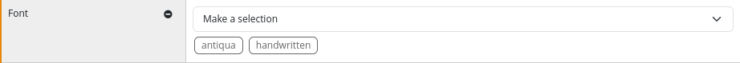
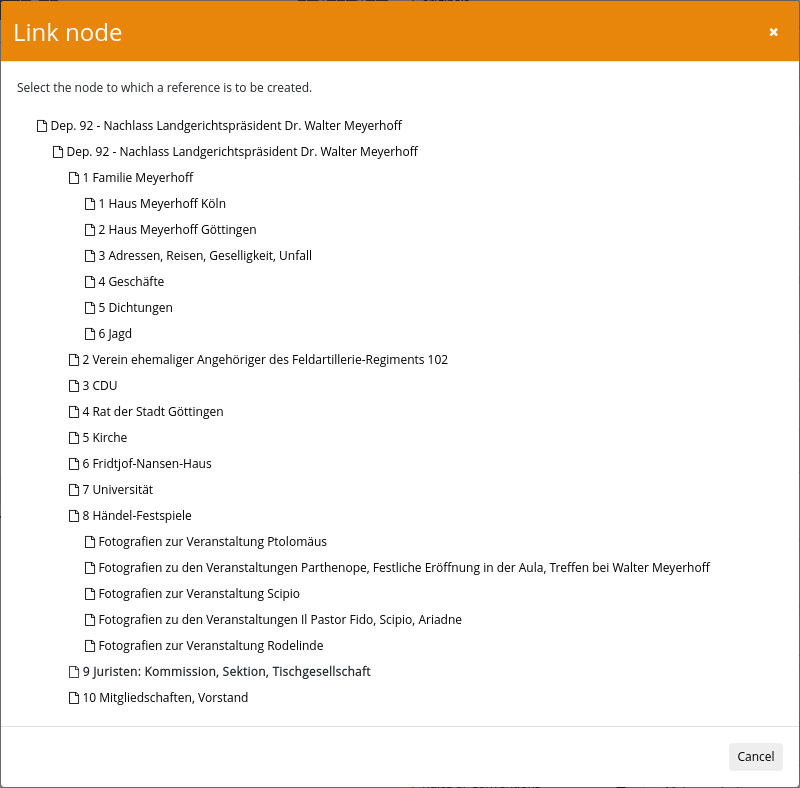
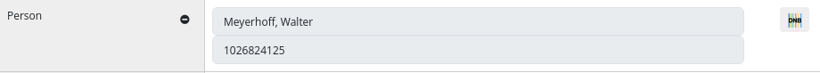

After installing the plugin and the associated database, the plugin must also be configured. This takes place within the configuration file `plugin_intranda_administration_archive_management.xml` and is structured as follows:

{{CONFIG_CONTENT}}

## General configuration

The connection to the viewer is configured in the `<export>` area. The location to which an export as EAD-XML is to take place and which inventories are to be exported are defined here. The export takes place automatically at regular intervals or can be started manually from the user interface.

In the second area `<backup>` an automatic backup of the individual inventories can be configured. A separate file is created for each inventory. You can define how many backups should be kept and which tool should be used to create the backups. If a password is required for database access, this can also be configured here.

This is followed by a repeatable `<config>` block. The repeatable element `<archive>` can be used to specify for which files the `<config>` block should apply. If there should be a default block that should apply to all documents, `*` can be used.

The `<processTemplateId>` is used to specify which process template should be used as the basis for the Goobi processes created.

## Configuration of the generation of process titles
The parameters `<lengthLimit>` `<separator>` `<useIdFromParent>` and `<title>` are used to configure the naming of the process to be generated:

* The `<lengthLimit>` value sets a length limit for all tokens except the manually set prefix and suffix. The default setting is `0`, i.e. it does not limit the length.
* The parameter `<separator>` defines the separator to be used to combine all separate tokens. The default setting is `_`.
- The parameter `<useIdFromParent>` configures whose ID should be used to create the process title. If it is set to `true`, the ID of the parent node is used. Otherwise, the ID of the current node is used.
- The `<title>` parameter configures which metadata is to be used for title generation. The `value` attribute can contain a static text or the `name` attribute can contain the name of a metadata field. The `type` is used to control what should happen with the value `NORMAL` inserts the field unchanged, `CAMEL_CASE` replaces spaces and starts each word with a capital letter, `AFTER_LAST_SEPARATOR` always inserts the field at the end, `BEFORE_FIRST_SEPARATOR` always inserts it at the beginning. If no title has been configured, the process title is formed on the basis of the node ID. 


## Configuring the metadata fields

This is followed by a list of `<metadata>` elements. This controls which fields are displayed, can be imported, how they should behave and whether there are validation rules.

### Mandatory fields

Each metadata field consists of at least these mandatory fields:

| Value | Description |
| :--- | :--- |
| `name` | This value identifies the field. It must therefore contain a unique designation. If the value has not been configured separately in the messages files, it is also used as the label of the field. |
| `level` | This defines the area in which the metadatum is inserted. The numbers 1-7 are allowed: `1. Identity Statement Area`, `2. Context Area`, `3. Content and Structure Area`, `4. Condition of Access and Use Area`, `5. Allied Materials Area`, `6. Note Area`, `7. Description Control Area` |


### Optional information

There are also a number of other optional specifications:

| Value | Description |
| :--- | :--- |
| `xpath` | Defines an XPath expression that is used both to read from existing EAD files and to write to the EAD file. The path is relative to the `<ead>` element in the case of the main element, and always relative to the `<c>` element for all other nodes. |
| `@xpathType` | This defines whether the XPath expression returns an `element` \(default\), an `attribute` or a `text`. |
| `@visible` | This can be used to control whether the metadata is displayed in the mask or is hidden. The field may contain the two values `true` \(default\) and `false`. |
| `@repeatable` | Defines whether the field is repeatable. The field may contain the two values `true` and `false` \(default\). |
| `@showField` | Defines whether the field is displayed open in the detail display, even if no value is available yet. The field may contain the two values `true` and `false` \(default\). |
| `@rulesetName` | A metadata from the rule set can be specified here. When a Goobi process is created for the node, the configured metadata is created. |
| `@importMetadataInChild` | This can be used to control whether the metadate should also be created in Goobi processes of child nodes. The field may contain the two values `true` and `false` \(default\). |
| `@fieldType` | Controls the behaviour of the field. Possible are `input` \(default\) , `textarea`, `dropdown`, `multiselect`, `vocabulary`, `nodelink`, `gnd`, `geonames`, `viaf`. |
| `value` | This sub-element is only used with the two types `dropdown` and `multiselect` and contains the possible values that are to be available for selection. |
| `vocabulary` | This subelement contains the name of the vocabulary to be used. It is only evaluated if `vocabulary` is set in the type of the field. The selection list contains the main value of each record. |
| `searchParameter` | This repeatable subfield can be used to define search parameters with which to filter the vocabulary, the syntax is `fieldname=value`. |
| `@validationType` | Here you can set whether the field should be validated. Different rules are possible, which can be combined. `unique` checks that the content of the field has not been used again in another place, `required` ensures that the field contains a value. The type `regex` can be used to check whether the filled value corresponds to a regular expression, `date` checks, if the value is a valid EDTF format and `list` checks, if the value is part of the configured list. Several validation rules can also be combined, for example `unique+required`, `regex+required`, `regex+unique` or `date+required`. In this case, all specified rules must be fulfilled. |
| `@regularExpression` | The regular expression to be used for `regex` validation is specified here. IMPORTANT: the backslash must be masked by a second backslash. A class is therefore not defined by `\w` but by `\\w`. |
| `validationError` | This subfield contains a text that is displayed if the field content violates the validation rules. |
| `@searchable` | This can be used to control whether the metadata should be offered as a field in the advanced search. The field may contain the two values `true` and `false` \(default\). |

## Examples of different field configurations

### Simple input field

```xml
<metadata xpath="./ead:control/ead:maintenanceagency/ead:agencycode" xpathType="element" name="agencycode" level="1" repeatable="false" fieldType="input"/>
```


### Text area

```xml
<metadata xpath="(./ead:archdesc/ead:did/ead:unittitle | ./ead:did/ead:unittitle)[1]" xpathType="element" name="unittitle" level="1" repeatable="false" fieldType="textarea" rulesetName="TitleDocMain" importMetadataInChild="false" />
```


### Selection list

```xml
<metadata xpath="(./ead:archdesc/@level | ./@level)[1]" xpathType="attribute" name="descriptionLevel" level="1" repeatable="false" fieldType="dropdown">
    <value>collection</value>
    <value>fonds</value>
    <value>class</value>
    <value>recordgrp</value>
    <value>series</value>
    <value>subfonds</value>
    <value>subgrp</value>
    <value>subseries</value>
    <value>file</value>
    <value>item</value>
    <value>otherlevel</value>
</metadata>
```


### Multiple selection

```xml
        <metadata xpath="(./ead:archdesc/ead:did/ead:langmaterial[@label='font'] | ./ead:did/ead:langmaterial[@label='font'])[1]" xpathType="element" name="font" level="4" repeatable="false"
            fieldType="multiselect" rulesetName="FontType" importMetadataInChild="false">
            <value>antiqua</value>
            <value>fracture</value>
            <value>handwritten</value>
            <value>mixed</value>
            <value>no text</value>
        </metadata>
```



### Validation of dates in ISO 8601 format

```xml
<metadata xpath="(./ead:archdesc/ead:did/ead:unitdate | ./ead:did/ead:unitdate)[1]" xpathType="element" name="unitdate" level="1" repeatable="false" rulesetName="PublicationYear" importMetadataInChild="false" regularExpression="^([0-9]{4}\\-[0-9]{2}\\-[0-9]{2}|[0-9]{4})(\\s?\\-\s?([0-9]{4}\\-[0-9]{2}\\-[0-9]{2}|[0-9]{4}))?$" validationType="regex">
  <validationError>The value is not a date specification. Permitted values are either years (YYYY), exact dates (YYYY-MM-DD) or time periods (YYYY - YYYY, YYYY-MM-DD-YYYY-MM-DD).</validationError>
</metadata>
```
### Validation of dates in EDTF format

```xml
<metadata xpath="(./ead:archdesc/ead:did/ead:unitdate | ./ead:did/ead:unitdate)[1]" xpathType="element" name="unitdate" level="1" repeatable="false" rulesetName="PublicationYear" importMetadataInChild="false" validationType="date">
  <validationError>Der Wert ist keine Datumsangabe</validationError>
</metadata>
```

### Connection of a controlled vocabulary

```xml
<metadata xpath="(./ead:archdesc/ead:dsc/ead:acqinfo | ./ead:dsc/ead:acqinfo)[1]" xpathType="element" name="acqinfo" level="2" repeatable="false" fieldType="vocabulary" rulesetName="AquisitionInformation" >
  <vocabulary>Aquisition</vocabulary>
  <searchParameter>type=visible</searchParameter>
  <searchParameter>active=true</searchParameter>
</metadata>
```
### Reference to another node within the inventory

```xml
        <metadata xpath="(./ead:archdesc/ead:relatedmaterial/ead:ref | ./ead:relatedmaterial/ead:ref)" xpathType="element" name="nodelink" fieldType="nodelink" level="5" repeatable="false" />
```





### Search in GND

```xml
            <metadata xpath="./ead:archdesc/ead:index/ead:indexentry/ead:persname/ead:part" xpathType="element" name="Person" level="7" repeatable="true" fieldType="gnd" visible="true" />
```



## Search in Geonames

```xml
            <metadata xpath="./ead:archdesc/ead:index/ead:indexentry/ead:geogname/ead:part[@localtype='place']" xpathType="element" name="Place" level="7" repeatable="true" fieldType="geonames" visible="true" />
```


## Search in VIAF

```xml
            <metadata xpath="./ead:archdesc/ead:index/ead:indexentry/ead:corpname/ead:part" xpathType="element" name="Corporate" level="7" repeatable="true"
                searchable="true" showField="true" fieldType="viaf" searchFields="210__a; 111__a; 100__a; 110__a; 150__a; 151__a;"
                displayFields="001=NORM_IDENTIFIER; 0247_a=URI; 1001_a=NORM_NAME; 1001_d=NORM_LIFEPERIOD; 1001_q=NORM_SEX; 375__a=NORM_SEX;" />
```


## Configuration of the visibility of the areas

In the default setting, the individual sections 1. `Identity Statement Area`, 2. `Context Area`, 3. `Content and Structure Area`, 4. `Condition of Access and Use Area`, 5. `Allied Materials Area`, 6. `Note Area`, 7. `Description Control Area` are collapsed and are not displayed. The element `<showGroup level=‘1’ />` can be used so that they are already expanded and displayed when a node is selected. The ordinal number in the level attribute is used to control which area is expanded. The attribute `<showField=‘true’` can be used within the `<metadata>` definition to display unfilled metadata immediately without adding it using a badge.

## XML Namespace configuration

The two elements `<eadNamespaceRead>` and `<eadNamespaceWrite>` define which XML namespaces are to be used for reading and writing EAD documents. Both usually contain the same value. However, EAD2 documents can also be read and exported as EAD3 documents. In this case, the corresponding namespaces must be defined and care must be taken in the xpath expressions of the individual metadata to ensure that both variants are specified. It is therefore easier to use the enclosed converter and convert from EAD2 to EAD3 before importing the documents.

- Namespace for ead2 (deprecated): urn:isbn:1-931666-22-9
- Namespace for ead3 (current): http://ead3.archivists.org/schema/
- Namespace for ead4 (draft Status): https://archivists.org/ns/ead/v4
